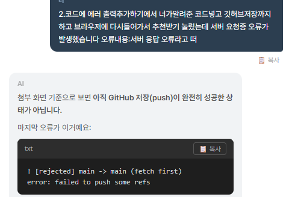

# Today Menu AI

## 1. 프로젝트 소개

**Today Menu AI**는 사용자의 조건을 입력받아 AI가 맞춤형 식단을 추천해주는 웹 서비스입니다.

사용자는 예산, 선호 음식, 식사 상황 등을 입력할 수 있으며, Gemini API를 활용하여 조건에 맞는 메뉴 추천 결과를 받을 수 있습니다.

---

## 2. 주요 기능

- 사용자 입력 기반 AI 식단 추천
- 예산, 취향, 상황에 맞는 메뉴 추천
- Gemini API 연동
- 입력값 검증 및 오류 처리
- 데스크톱 / 모바일 반응형 웹 화면
- Vercel 배포

---

## 3. 사용 기술

### Frontend
- HTML
- CSS
- JavaScript

### Backend
- Python
- Flask
- requests

### AI API
- Google Gemini API

### Deployment
- GitHub
- Vercel

---

## 4. AI 기능 설명

이 프로젝트는 Google Gemini API를 사용하여 사용자의 입력 조건에 맞는 식단을 추천합니다.

사용자가 입력한 내용은 서버로 전달되고, 서버에서는 Gemini API에 요청을 보낸 뒤 AI가 생성한 추천 결과를 다시 화면에 출력합니다.

예시 입력 조건:

- 식사 스타일
- 선호 음식 또는 재료
- 피하고 싶은 음식
- 하루 예산

---

## 5. 실행 방법

### 1) GitHub 저장소 클론

```bash
git clone https://github.com/본인깃허브아이디/레포지토리이름.git
cd 레포지토리이름
```

### 2) 필요한 라이브러리 설치

```bash
pip install -r requirements.txt
```

### 3) 환경 변수 파일 생성

프로젝트 루트 폴더에 `.env` 파일을 생성합니다.

```env
GEMINI_API_KEY=본인의_Gemini_API_Key
```

주의: 실제 API Key는 GitHub에 올리면 안 됩니다.

`.gitignore` 파일에 아래 내용을 추가하여 `.env` 파일이 업로드되지 않도록 합니다.

```gitignore
.env
```

### 4) 로컬 서버 실행

```bash
python app.py
```

또는 Flask 실행 방식에 따라 아래 명령어를 사용할 수 있습니다.

```bash
flask run
```

### 5) 브라우저에서 접속

서버 실행 후 아래 주소로 접속합니다.

```txt
http://localhost:5000
```

---

## 6. 배포 방법

이 프로젝트는 Vercel을 사용하여 배포했습니다.

### Vercel 배포 과정

1. GitHub에 프로젝트 코드를 push합니다.
2. Vercel에 로그인합니다.
3. `Add New Project`를 클릭합니다.
4. GitHub 저장소를 선택하여 프로젝트를 가져옵니다.
5. Environment Variables에 Gemini API Key를 등록합니다.
6. Deploy 버튼을 눌러 배포합니다.
7. 배포가 완료되면 Vercel에서 제공하는 URL로 접속합니다.

---

## 7. 환경 변수 설정 방법

Gemini API를 사용하기 위해 API Key를 코드에 직접 작성하지 않고 환경 변수로 관리했습니다.

### 로컬 환경 변수 설정

로컬에서 실행할 때는 프로젝트 루트 경로에 `.env` 파일을 만들고 아래처럼 작성합니다.

```env
GEMINI_API_KEY=본인의_Gemini_API_Key
```

실제 API Key는 보안상 README나 GitHub에 공개하지 않습니다.

---

### Vercel 환경 변수 설정

Vercel 배포 환경에서는 아래 경로에서 환경 변수를 등록합니다.

```txt
Vercel Project → Settings → Environment Variables
```

등록할 환경 변수는 다음과 같습니다.

| Name | Value |
|---|---|
| GEMINI_API_KEY | 본인의 Gemini API Key |

환경 변수 등록 후 다시 Deploy를 진행하면 배포된 서비스에서 Gemini API를 사용할 수 있습니다.

---

## 8. 에러 처리

다음과 같은 상황에 대한 에러 처리를 구현했습니다.

- 입력값이 비어 있을 때 안내 메시지 출력
- Gemini API 요청 실패 시 오류 메시지 출력
- 서버 요청 실패 시 사용자에게 오류 안내
- 응답 시간이 오래 걸릴 경우 예외 처리
- 잘못된 요청에 대한 기본 오류 메시지 출력

---

## 9. 배포 주소

서비스 배포 주소는 아래와 같습니다.

- Vercel: https://a1-3-m9t00pfoj-darknight5.vercel.app/
  
## 10. GitHub 저장소

GitHub 저장소 주소는 아래와 같습니다.

- GitHub: https://github.com/jhsy1600-dev/a1-3

---

## 11. 화면 캡처

### 1) 데스크톱 화면


---

### 2) 모바일 화면


---

### 3) AI 추천 결과 화면


---

### 4) AI 코딩 도구 사용 과정



---

## 12. AI 코딩 도구 사용 내역

프로젝트 개발 과정에서 AI 코딩 도구를 활용하여 다음 작업에 도움을 받았습니다.

- Gemini API 연동 방법 확인
- 서버 요청 오류 해결
- Flask 관련 오류 해결
- Vercel 배포 오류 해결
- GitHub push 오류 해결
- README 작성 및 제출 자료 정리

AI 코딩 도구는 오류 원인을 파악하고 해결 방향을 찾는 데 활용했으며, 최종 코드는 직접 수정하고 테스트했습니다.

---

